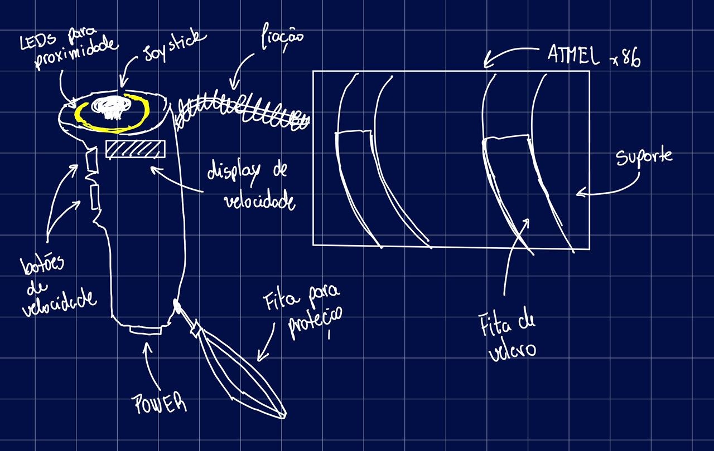

# Projeto Embarcados

Desenvolvendo um controle remoto.

## Entrega 1

### Integrantes

- Francisco Janela
- Nicolas Queiroga

### Ideia

Vamos criar um controle remoto para movimentar o robô TurtleBot pos meio da integração com o Rospy.

### Nome

TB Controller

### Usuários 

1. George, o Curioso, tem 18 anos e acabou de entrar no curso de engenharia do Insper. Adora explorar novas tecnologias e participar das exposições dos trabalhos de seus colegas da faculdade. Valoriza inovação, criatividade e tem um apelo inorme pelo desconhecido.

2. Susan Test é uma estudante e pesquisadora na área mecatrônica, tem 25 anos. Está trabalhando atualmente numa startup de automatização de estoque. Valoriza praticidade, intuitividade e simplicidade.

### Software/Jogo 

O controle será integrado ao código Rospy para controlar o TurtleBot físicamente.

### Jornada do usuários (3 pts)

1. Jornada do George:
    - George chegou no insper no dia do evento de mostra de projetos da graduação.
    - Viu o poster na parede que indicava para a sala do 5° semestre de Comp.
    - Ao chegar na sala se deparou com os alunos testando o TB Controler e quis brincar também.
    - Chegou sua vez, colocou o suporte da placa no braço, apertou o velcro. Pegou o controle na mão e rapidamente aprendeu os controles.
    - Se divertiu muito brincando e vendo o sensor lazer de distância atuando nos LEDs.

2. Jornada da Susan:
    - Susan usa normalmente o projeto para seu dia-a-dia.
    - Ela entra em seu galpão de teste, e antes de testar o robô automático, ela liga o Turtle Bot e conecta ele pelo computador ao TB Controler.
    - Usa o projeto para verificar se o plano de rota é executável, descobrir que distância virar e qual a velocidade ideal para cada trecho de seu trajeto.
    - Depois de terminar guarda o ferramental na sala e parte para o código de automação.
    - Economizou tempo e ajudou a encontrar "bottle necks" no projeto.

### Comandos/ Feedbacks (2 pts)

O controle possui um Joystick responsável pela movimentação do robô e seu botão central para rodar 180° em seu eixo, dois botões para controlar o multiplicador da velocidade do robô e um botão para ligar/desligar o controle.

Como feedback, o controle possui uma luz no botão de ligar/desligar para indicar os status de desligado, pareando e conectado, leds coloridos em um formato circular para representar o sensor de distância do robô, indicando se ele está chegando perto de alguma parede, e um display para mostrar a velocidade configurada pelos botões.

## In/OUT (3 pts)

- Controle de movimento e rotação 180°: Joystick;
  - Racional: Movimentar o robô com variação de intensidade dependendo da posição do joystick precisa de entrada analógica, já o clique para rotação 180° será uma ação binária, mas também ligada À movimentação do robô.
- Ligar/desligar: Botão com símbolo de power e LED indicador de estado;
  - Racional: Ligar e desligar é uma ação binária, mas se for segurado, entrará novamente em modo de pareamento. O LED será o feedback visual do estado do controle, mantendo-o minimalista e simples.
- Aumentar/diminuir velocidade: dois push buttons com atuação sensível;
  - Racional: ação binária de clicar para aumentar ou diminuir, dependendo de qual botão foi apertado. Sensível para ser mais fácil de clicar, uma vez que a mão estará dobrada para segurar o controle, e isso diminui a força de clicar no botão. 
- FeedBack de proximidade: 4 LEDs RGB;
  - Racinal: com quatro leds saberemos em que direção o robô está perto de um objeto e tornará sua direção mais simples caso haja perda de visibilidade. Além disso a cor pode nos mostrar a distância do objeto em uma escala de cores
- Display de Velocidade: Display 16x2;
  - Demonstrativo visual para o usuário poder se referenciar qual é o multiplicador de velocidade atual do robô setado por ele.

### Design (2 pts)

